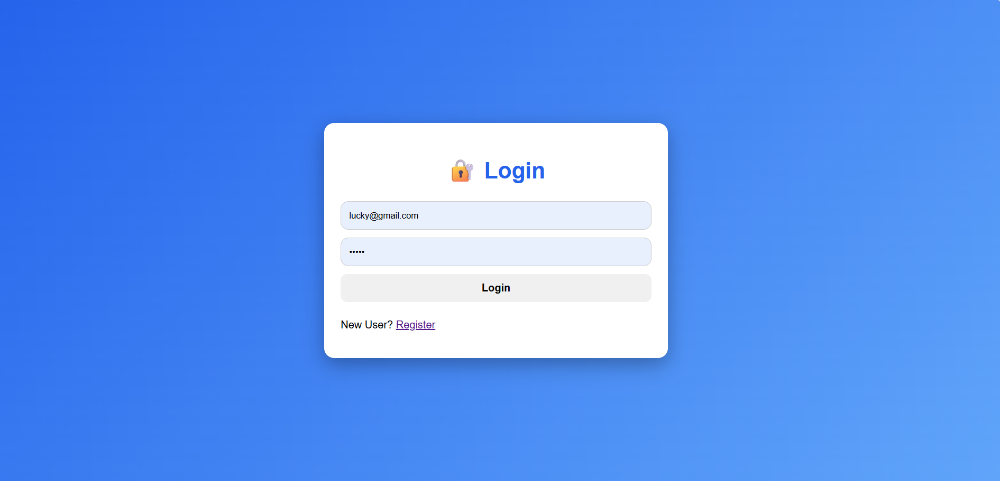
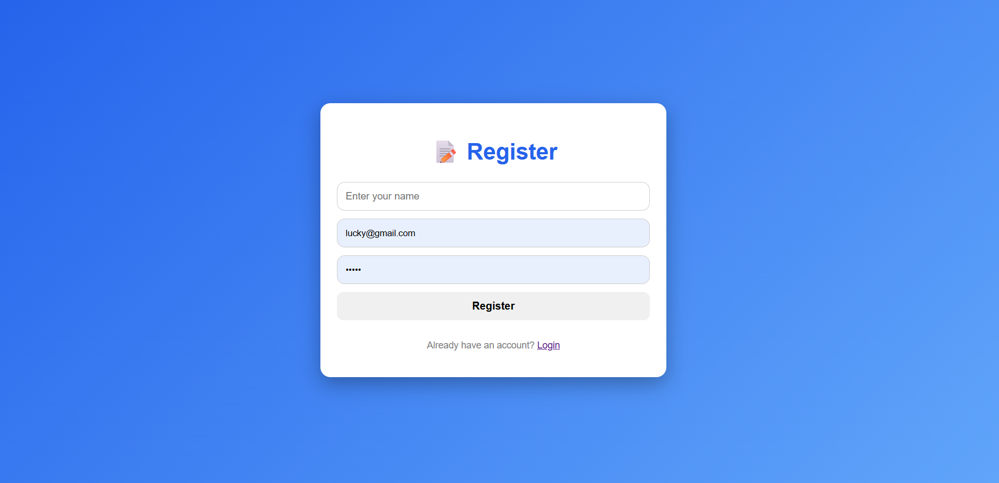
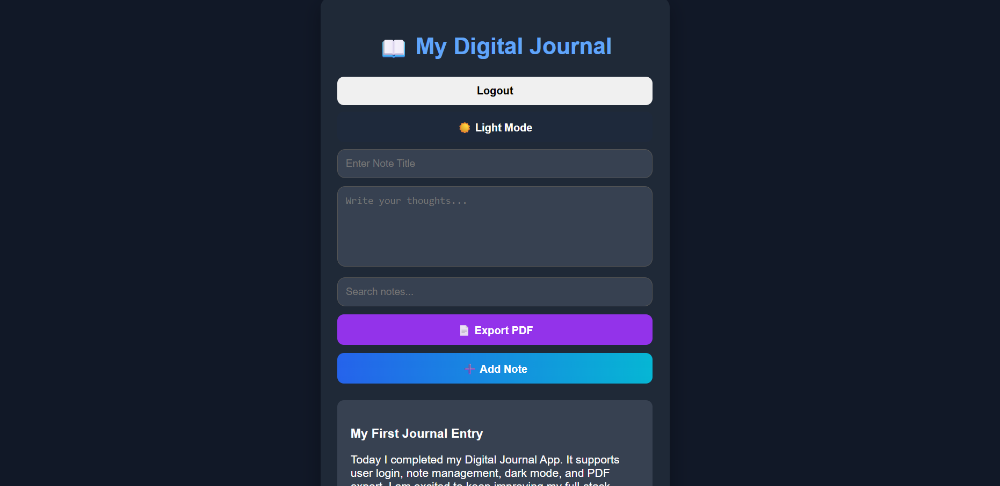

# 📝 Digital Journal App

A modern and secure Digital Journal web application that allows users to write, manage, and organize their personal journal entries. The application includes user authentication, note management, dark mode, and PDF export functionality.

---

## Internship Submission

 - **Intern ID:** CITS1788
 - **Full Name:** KUSUME LAKSHMI PRASANNA
 - **No. of Weeks:** 8 Weeks 
 - **Project Name:** BrainStorm Arena – Multi-Subject Full-Stack Quiz Platform
 - **Domain**: Full Stack Web Development

---

## 🚀 Features

- 🔐 User Registration & Login
- 📝 Create, Edit, and Delete Notes
- 🌙 Dark Mode
- 📄 Export Notes as PDF
- 💻 Responsive User Interface
- 🔒 Secure Authentication
- ⚡ Fast and Easy to Use

---

## 🛠️ Tech Stack

### Frontend
- HTML5
- CSS3
- JavaScript

### Backend
- Node.js
- Express.js

### Database
- MongoDB

---

## 📂 Project Structure

```
Digital-Journal-App/
│── frontend/
│── backend/
│── models/
│── routes/
│── public/
│── style.css
│── README.md
```

---

## Create .env file 

MONGO_URI=your connection link

port=5000

---

## ⚙️ Installation

1. Clone the repository

```bash
git clone https://github.com/your-username/digital-journal-app.git
```

2. Install dependencies

```bash
npm install
```

3. Start MongoDB

4. Run the backend

```bash
npm start
```

5. Open the application in your browser

```
http://localhost:5000
```

---

## 📸 Screenshots

<p align="center">
  
</p>

<p align="center">
  
</p>

<p align="center">
  
</p>

---

## 🎯 Future Enhancements

- 📱 Mobile Responsive Design
- 📧 Email Verification
- ☁️ Cloud Storage
- 🔍 Advanced Search
- 🏷️ Note Categories
- ⭐ Favorite Notes

---

## 👩‍💻 Author

**KUSUME LAKSHMI PRASANNA**

B.Tech - Computer Science & Systems Engineering

GitHub: https://github.com/your-username

---

## 📜 License

This project is developed for educational and learning purposes.